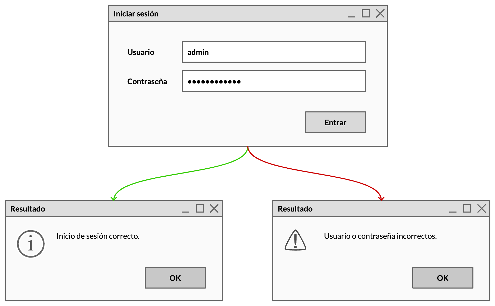

# Login

Crea una ventana de *login* para una aplicación que estamos construyendo.

En la imagen podemos ver cómo tiene que ser y funcionar:



Para poder comprobar su funcionamiento, los datos de usuario y contraseña serán siempre los mismos.

## Sugerencias

Para visualizar los mensajes puedes usar `JOptionPane` de este modo:

```java
JOptionPane.showMessageDialog(null, "Mensaje", "Título", JOptionPane.ERROR_MESSAGE);

JOptionPane.showMessageDialog(null, "Mensaje", "Título", JOptionPane.INFORMATION_MESSAGE);
```

El primer parámetro de `showMessageDialog()` es una referencia al componente del que depende el cuadro de diálogo.

Si se le pasa un valor distinto de `null`, por ejemplo la referencia a un `JPanel` o  `JFrame`, no se podrá volver a la ventana que contenga a ese control hasta aceptar o cancelar el cuadro de diálogo. Se dice entonces que es un cuadro de diálogo _modal_.

Más información sobre cómo crear cuadros de diálogo [aquí](https://www.laurafolgado.es/desarrollointerfaces/2015/10/cuadros-de-dialogo-con-joptionpane/).
