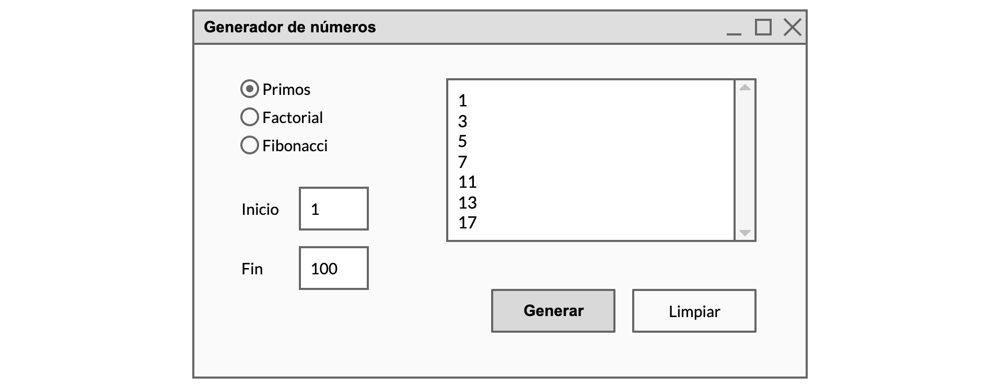

# Generador de números

Diseña una aplicación que muestre una ventana como esta:



## Funcionamiento

- El usuario podrá elegir el tipo de secuencia numérica que tenemos que generar (números primos, factoriales o términos de la sucesión de Fibonacci) y los valores de comienzo y final.
- Cuando pulse en generar el programa hará los cálculos necesarios y mostrará la secuencia correspondiente.
- El botón de limpiar reiniciará el interfaz a los valores por defecto.

## Restricciones

- El programa dispondrá de dos clases `VentanaPrincipal` y `Generador`:

    ```plantuml
    @startuml
    skinparam classAttributeIconSize 0
    skinparam nodesep 100
    skinparam ranksep 80
    
    class VentanaPrincipal {
    }
    
    class Generador {
    + esPrimo(n: int): true
    + factorial(n: BigInteger): BigInteger
    + fibonacci(n: BigInteger): BigInteger
    }
    
    VentanaPrincipal - Generador
    
    @enduml
    ```

- Controla las posibles excepciones a la hora de recoger los valores de inicio y fin.

## Sugerencias

Para mostrar la secuencia numérica en un cuadro de texto con barras de desplazamiento coloca un `JScrollPane` y dentro de él pon un `JTextArea`.
