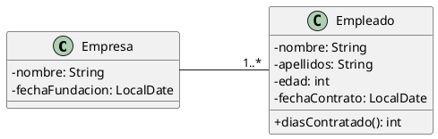

# Empresa y empleados

Queremos construir una aplicación que permita almacenar información sobre empresas y sus empleados, tal como aparecen en
el siguiente diagrama de clases:



El programa mostrará un menú como el siguiente:

```plaintext
1. Crear nueva empresa.
2. Añadir empleado a empresa ya existente.
3. Listado de empresas.
4. Listado detallado de empresas y empleados.
5. Salir
```

El programa principal pedirá al usuario todos los datos necesarios y creará los objetos que hagan falta.

Al visualizar un empleado se deberá incluir el número de días que lleva contratado en la empresa a día de hoy, llamando
al método `diasContratado()` que será quien haga el cálculo.

## Sugerencias

Para almacenar la fecha de contrato,
usaremos [un objeto de tipo `LocalDate`](https://www.baeldung.com/java-8-date-time-intro#1-working-with-localdate).

Para calcular la diferencia entre fechas se puede usar `ChronoUnit.between`, como se
explica [aquí](https://www.baeldung.com/java-8-date-time-intro#1-working-with-period).

## Restricciones

- No hay límite en el número de empresas ni de empleados.
- El programa no termina hasta que se elija la opción de salir.
- Es obligatorio tratar las posibles excepciones de forma adecuada.
