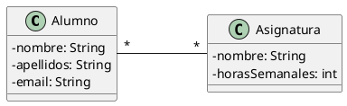

# Alumnos y asignaturas

Queremos construir una aplicación que permita almacenar información sobre alumnos y las asignaturas en las que están
matriculados, tal como aparecen en el siguiente diagrama de clases:



El programa mostrará un menú como el siguiente:

```plaintext
1. Crear nuevo alumno.
2. Crear nueva asignatura.
3. Matricular alumno en asignatura.
4. Listado de alumnos matriculados en una asignatura.
5. Listado de asignaturas en las que está matriculado un alumno y total de horas.
6. Salir
```

El programa principal pedirá al usuario todos los datos necesarios y creará los objetos que hagan falta.

## Restricciones

- No hay límite en el número de alumnos y asignaturas que podemos almacenar.
- El programa no termina hasta que se elija la opción de salir.
- Es obligatorio tratar las posibles excepciones de forma adecuada.
