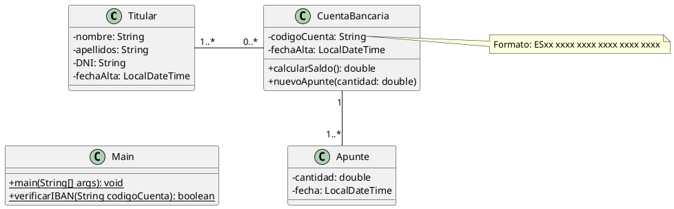

# Cuenta bancaria

Queremos construir una aplicación que nos permita mantener información sobre cuentas bancarias, tal como aparecen en el
siguiente diagrama de clases:



El programa mostrará un menú como el siguiente:

```plaintext
1. Titular
	a. Nuevo titular
2. Cuenta bancaria
	a. Nueva cuenta
	b. Nuevo apunte
	c. Borrar cuenta
3. Consultas
	a. Dado un titular, saldo de todas sus cuentas
	b. Dada una cuenta, titulares asociados
4. Salir
```

El programa principal pedirá al usuario todos los datos necesarios y creará los objetos que hagan falta.

## Sugerencias

Las fechas se almacenan
usando [la clase LocalDateTime](https://www.baeldung.com/java-8-date-time-intro#3-working-with-localdatetime).

## Restricciones

- Al crear una cuenta, se pedirá al usuario un código IBAN válido que comprobaremos usando la función `verificarIBAN()`
  que desarrollamos en su momento.
- Solo se pueden crear apuntes llamando al método `nuevoApunte()` de la cuenta.
- El saldo de la cuenta no se almacena, se calcula cada vez que se llama a `calcularSaldo()`.
- Las fechas no se preguntan al usuario, se almacenan automáticamente obteniéndolas del sistema.
- No hay límite en el número de titulares, cuentas ni apuntes.
- El programa no termina hasta que se elija la opción de salir.
- Es obligatorio tratar las posibles excepciones de forma adecuada.
