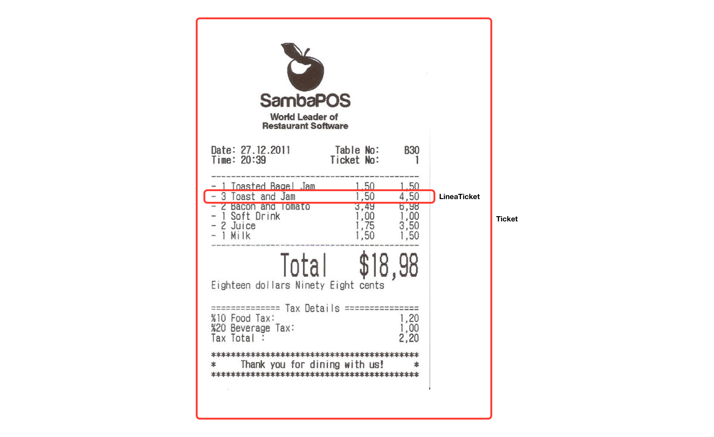

# Ticket

Diseña el diagrama de clases y escribe el programa para almacenar un ticket de supermercado, modelando las
clases `Ticket` y `LineaTicket`.

Del ticket, pediremos al usuario la fecha, hora y número de ticket.

Por cada línea, el usuario introduce el nombre del producto, el precio por unidad y el número de unidades, sin límite de
líneas, hasta que nos responda que ha terminado.

El programa sacará en pantalla:

- Los detalles generales del ticket.
- El listado con el nombre de cada producto, las unidades vendidas y el precio total.
- El total que resulte de sumar todas las líneas del ticket.

## Restricciones

- La fecha y la hora se almacenan como `String`.
- Recuerda crear una asociación de 1 a N entre las dos clases, vinculando los objetos entre sí correctamente.
