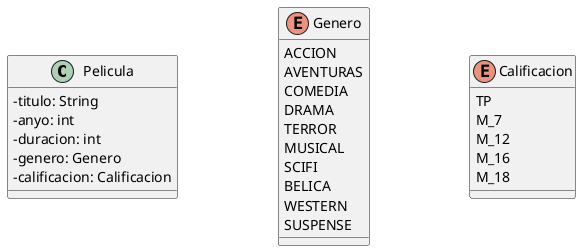

# Cartelera

Crea un programa que permita almacenar y mostrar la información de la cartelera de un cine partiendo de este diagrama de clases:



## Requisitos

El programa mostrará un menú como este:

```text
1. Publicar película
2. Borrar película
3. Ver cartelera
4. Salir
```

### Publicar película

Pedirá al usuario los datos necesarios para completar una película y la sala en la que se proyecta. Después la almacenará en un array de objetos donde cada posición de ese array representa una sala del cine. Si en esa sala ya hay una película, mostrará un mensaje de error y no se modificará.

### Borrar película

Pedirá al usuario el número de sala y eliminará la película almacenada en esa posición.

### Ver cartelera

Mostrará las películas disponibles en un listado con forma de tabla en el que como columnas aparecerán el número de sala y todos los atributos de la clase `Pelicula`.

## Sugerencias

Recuerda que cuando una referencia a un objeto no está definida su valor será `null` y que también se puede asignar ese valor a una variable para eliminar la conexión al objeto referenciado por ella.

## Restricciones

- El cine tiene 7 salas.
- El programa no termina hasta que el usuario elige la opción `Salir`.
- Controla las posibles excepciones para garantizar que el programa no se detiene de forma inesperada.
