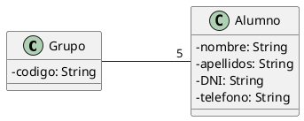

# Grupo y alumnos

Modela las clases `Grupo` y `Alumno`.

```plantuml
@startuml
skinparam classAttributeIconSize 0
skinparam nodesep 100
skinparam ranksep 80

class Grupo {
- codigo: String
}

class Alumno {
- nombre: String
- apellidos: String
- DNI: String
- telefono: String
}

Grupo - "5" Alumno

@enduml
```

Desde el programa principal crea un grupo, asóciale 5 alumnos y muestra todo el conjunto en pantalla.
