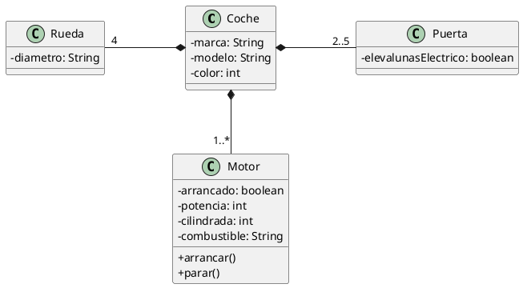

# Coche

Queremos modelar un coche en Java. Sigue el diagrama que se proporciona y crea los objetos necesarios, con sus relaciones, pidiéndole los datos al usuario para instanciar un objeto de tipo `Coche` y mostrarlo después en pantalla.

### Relación entre Coche y Motor:

- **Notación:** `Coche *-- "1..*" Motor`
- **Tipo de relación:** Composición.
- **Descripción:** Indica que un coche tiene uno o más motores (`1..*`). Esta es una relación de composición, lo que sugiere una relación bidireccional en la práctica, ya que el Motor depende del Coche para su existencia.

### Relación entre Coche y Rueda:

- **Notación:** `Rueda "4" -* Coche`
- **Tipo de relación:** Agregación.
- **Descripción:** Indica que un coche tiene cuatro ruedas (`4`). Esta es una relación de agregación, que generalmente implica una relación unidireccional, ya que el Coche contiene Rueda pero una rueda no necesariamente contiene al coche. Sin embargo, podría interpretarse como una relación bidireccional si se implementa de esa manera.

### Relación entre Coche y Puerta:

- **Notación:** `Coche *- "2..5" Puerta`
- **Tipo de relación:** Agregación.
- **Descripción:** Indica que un coche tiene de dos a cinco puertas (`2..5`). Esta es otra relación de agregación, generalmente unidireccional, donde el Coche contiene Puerta pero una puerta no necesariamente contiene al coche.

### En resumen:

- **La relación entre Coche y Motor es bidireccional en la práctica.**
- **Las relaciones entre Coche y Rueda, así como Coche y Puerta, son unidireccionales.**

