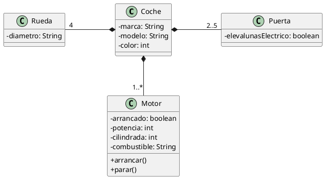

# Coche

Queremos modelar un coche en Java. Sigue el diagrama que se proporciona y crea los objetos necesarios, con sus relaciones, pidiéndole los datos al usuario para instanciar un objeto de tipo `Coche` y mostrarlo después en pantalla.

