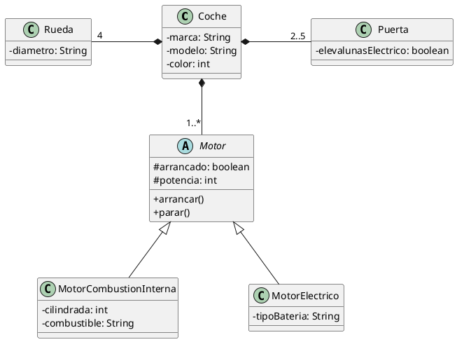

# Híbrido

El departamento de ingeniería ha perfeccionado nuestros sistemas de propulsión añadiendo motores eléctricos para mejorar la eficiencia, creando coches híbridos:

Añade las nuevas clases y crea los objetos necesarios, con sus relaciones, pidiéndole los datos al usuario para instanciar un objeto de la clase `Coche` con un motor de cada tipo; después muéstralo en pantalla.
