# Restaurantes

Queremos construir una aplicación que permita almacenar información sobre restaurantes que hemos visitado, siguiendo la
estructura que aparece en el siguiente diagrama de clases:

```plantuml
@startuml
skinparam classAttributeIconSize 0
skinparam nodesep 100
skinparam ranksep 80

class Restaurante {
- nombre: String
- estrellaMichelin: boolean
- precioMedio: double
+ valoracionMedia(): double 
}

class Valoracion {
- texto: String
- puntuacion: int
}

Restaurante "1" - "*" Valoracion

@enduml
    ```

El programa mostrará un menú como el siguiente:

```plaintext
1. Crear nuevo restaurante
2. Añadir una valoración a un restaurante
3. Listado de los restaurantes con estrella Michelin
4. Listado de los restaurantes con valoración media superior a 3
5. Listado de todos los restaurante con su valoración media
6. Salir
```

El programa principal pedirá al usuario todos los datos necesarios y creará los objetos que hagan falta.

Los restaurantes se puntúan con un valor entero de 0 a 5.

Al visualizar los restaurantes se deberá incluir la valoración media, llamando al método `valoracionMedia()` que será
quien haga el cálculo del valor medio de todas las puntuaciones asociadas al restaurante.

## Restricciones

- Para modelar la asociación se pueden utilizar listas o arrays; si se usan arrays el límite máximo de objetos será de 10.
- El programa no termina hasta que se elija la opción de salir.
- Es obligatorio tratar las posibles excepciones de forma adecuada.
