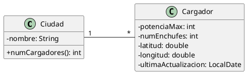

# Cargadores

Queremos construir una aplicación que permita almacenar información sobre cargadores para coches eléctricos.

Nos han proporcionado este diagrama de clases:



El programa mostrará un menú como el siguiente:

```plaintext
1. Dar de alta una ciudad
2. Añadir un cargador a una ciudad
3. Listado de los cargadores de una ciudad
4. Listado de todas las ciudades y total de cargadores en cada una
5. Ciudad con más cargadores y ciudad con menos
6. Salir
```

El programa principal pedirá al usuario todos los datos necesarios y creará los objetos que hagan falta.

## Restricciones

- Para modelar la asociación hay que utilizar listas.
- El programa no termina hasta que se elija la opción de salir.
- Es obligatorio tratar las posibles excepciones de forma adecuada.
