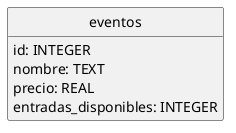

# Venta de entradas

Tu empresa está desarrollando una aplicación para gestionar la venta de entradas en eventos.

Dispones de una base de datos SQLite [`entradas.db`](entradas.db) con la siguiente estructura:

En la carpeta [`capturas`](capturas) hay más detalles sobre la base de datos.

Se pide desarrollar cada una de las siguientes ventanas.

## VPrincipal

Será la ventana a partir de la que arranque la aplicación.

Su trabajo consiste en:

- Cargar los datos desde la base de datos en una lista de objetos.
- Mostrar los botones necesarios para abrir las demás ventanas.

## VComprarEntradas

Mostrará:

- Una lista con todos los eventos disponibles.
- Un spinner para seleccionar el número de entradas a comprar.
- Un botón de compra.

El valor del spinner solo puede variar entre 1 y el número máximo de entradas disponibles para el evento seleccionado.

Al pulsar en el botón, se comprobará si hay suficientes entradas para ese evento y, si es así, se actualizarán el
interfaz de usuario y la base de datos.

Si no quedan suficientes entradas, mostrará un error.

## VEventos

Mostrará una tabla en la que se aparecerán todos los detalles de los eventos (precio, disponibilidad, etc.).

## Restricciones

- Es obligatorio crear un modelo de tabla personalizado, no se puede usar el modelo por defecto.
- Es obligatorio tratar las posibles excepciones de forma adecuada.
